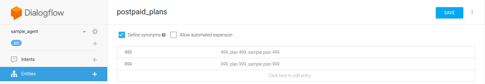

# Crash Course to DialogFlow
## What we will make:
* Postpaid Plan Inquiries
* Personality: Polite and Professional

## Conversational Design Flow


## Step - by - step building


### 1) Initialize the agent
Create an agent on the DialogFlow console and give it your desired name. `sample_agent` was used for this example


### 1.1) DialogFlow Console
Short Introductory to the DialogFlow console:

*1*: `Intents Tab`<br />
  Where you would build, delete and modify your intents<br />
*2*: `Entities Tab`<br />
  Where you would build, delete and modify your entities<br />
*3*: `Fulfillment Tab`<br />
  Where you would setup your fulfillment and webhooks<br />
*4*: `Integrations Tab`<br />
  Where you would setup your agent's integration<br />
*5*: `Tab Indicator`<br />
  Tells what tab you're currently at<br />
*6*: `Agent Tester`<br />
  Text Field are where you can test your agent (Intent invocations, etc.)

<div style="text-align:center"></div>
* The agent tester is also the diagnostic tool where we can check whether what intent was detected by our agent and other relevant information regarding the user query.

### 2) Change the response of the Default welcome Intent
There is a preloaded agent response provided by google under `Default Welcome Intent`, change it to the desired response when users greets the agent. In the example, we used:
```
Hi, Welcome to Sample Telecom! How may I help?
```
After changing the response, save it and use the `agent tester` to see the changes


### 3) Add a new intent for catering the plans - (INTENTS)
* Create a new intent for when the user is Asking the Plans. In the example we named it: `plans`
* Add the training phrases or the user utterances. Or what the user must say to trigger the intent
* Add the agent's response when this trigger is intent. For the example, we used: 
```
We are offering multiple plans to fit your budget and needs. We have Sample Plan 499 and Sample Plan 999. Please let me know what plan you would like to know more.
```
* Save the agent


### 4) Create entities for the plans - (ENTITIES)
From this example, we have seen that there are two plans of choice given by the agent. And instead of creating two different sets of intents, we could just make an entity for it to know what `Postpaid Plan` our user is talking about.
* On the `Entities` tab, click `Create Entity`
* Set the Entity Name to `postpaid_plans`
* Set the first property/parameter to `499` and set its synonyms
* Set the second property/parameter to `999` and set its synonyms
* Save the entity created
* Verify if the entity was created by going back to the `Entities` tab
* Add our response 



### 4.1) Create a new intent for specific plans chosen
An intent for specific plans will be created to cater the third scenario on where the user specifically says what Plan he or she would want.
* The intent name for this example is: `specific_plan`
* We will use our `postpaid_plans` entity here.
* Add the training phrases or invocations mentioning the entity
* Check for the parameters under `Actions and parameters` to verify whether the correct entity was detected for the current intent.


* For the response:
```
You chose Plan $postpaid_plans. Would you like to proceed?
```
* The `$postpaid_plans` is the variable carrying the parameter of the entity we have used.
* (OPTIONAL) Test it on the agent tester


### 4.2) Create a follow-up/sub-intent to catch the user's decision (FOLLOW-UP INTENTS)
You would want to have a separate response when a user said `yes` on the previous question of our intent, or when our user, said `no`.
* Hover to the `specific_plan` intent
* Select on the `Add follow-up inten`
   * Select the pre-made sub-intent by DialoFlow which is `Yes`
   * Do the steps again for `No`
* Check by hovering on the `specific_plan` intent again and clicking the drop down arrow


### 4.3) Edit the response on the yes (CONTEXT)
* Select `specific_plan - yes` sub intent
* Check for the Contexts, you will see `specific_plan-followup` on the input contexts
* On the conversational design flow, this would be the last intent so we would en our conversation here. Toggle enable the `Set this intent as the end of conversation`
* Add the response the agent will give back to the user:
```
Great! Here is your receipt for plan #.postpaid_plans : 072419. Please proceed to your nearest Sample Telecom store and present it for further processing. Thank you and have a nice day!
```
* `#specific_plan-followup` is the context containing all the entities and parameters from the previous conversation and `.postpaid_plans` is the entity that we used inside the said context.
* Test your flow

# For documentation and References:
* https://cloud.google.com/dialogflow/docs/

